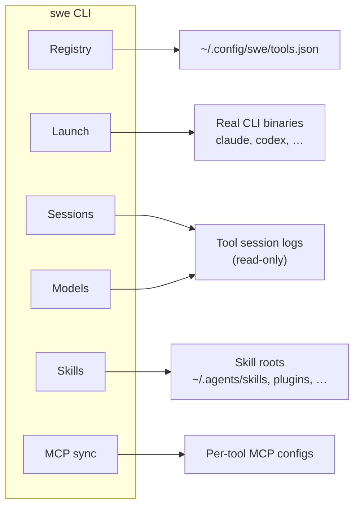

<p align="center">
  
</p>

<h1 align="center">
quiver
</h1>

<p align="center">
  <strong>One command to launch, resume, and analyze every AI coding CLI on your machine.</strong>
</p>

<p align="center">
  <a href="https://github.com/c-wenlong/quiver/actions/workflows/ci.yml"></a>
  <a href="LICENSE"></a>
  <a href="https://www.python.org/downloads/"></a>
  
</p>

<p align="center">
  <a href="#install">Install</a> ·
  <a href="#quick-start">Quick start</a> ·
  <a href="#commands">Commands</a> ·
  <a href="#skills">Skills</a> ·
  <a href="#how-it-works">How it works</a> ·
  <a href="#contributing">Contributing</a>
</p>

---

**quiver** is a central manager for the growing zoo of AI coding command-line tools — Claude Code, Codex, Gemini CLI, Cursor CLI, opencode, Copilot, and many more.

It keeps a small registry of the harnesses you use, launches any of them (by name or short alias), lets you resume recent sessions across *any* agent, mines read-only usage analytics from each tool's own logs, discovers agent skills installed across your machine, and keeps MCP server configs in sync between tools.

The command you type is **`swe`** (short, fits in muscle memory). The project and Python package are named **quiver** — think of it as the quiver that holds all your arrows (see the mascot above).

```
$ swe list

AI Coding Tools

  NAME             COMMAND            VERSION      ALIASES       100d  RATE        INST  DESCRIPTION
  ─────────────────────────────────────────────────────────────────────────────────────────────
  claude           claude             2.1.126      cc              412  —           ✓    Claude Code by Anthropic …
  codex            codex              0.133.0      cx              288  100% 5d19h  ✓    OpenAI Codex CLI
  opencode         opencode           1.17.11      oc               96  —           ✓    opencode — open source …
  gemini           gemini             0.35.1       gg               12  —           ✓    Gemini CLI by Google …
  cursor           agent              2026.06.24   cs                4  —           ✓    Cursor CLI — AI-powered …

  6/6 installed  ·  swe use <name|alias>  │  swe info <name>  │  swe list <tag>  │  swe check
  tags:  agentic  byok  coding  local  …
```

## Why quiver?

If you juggle more than one AI coding agent you end up with a mess:

- Different launch commands and resume flags for every tool
- Usage scattered across a dozen log formats
- MCP server definitions copy-pasted between configs
- Skills installed in five different directory trees

**quiver** puts a single, consistent front door on all of it — without wrapping or replacing the tools themselves. It reads their logs read-only and shells out to the real binaries.

## Features

| Area | What you get |
| --- | --- |
| **Registry** | List every AI coding CLI with tags, aliases, versions, and install status |
| **Launch** | Start any tool by name or alias; extra args pass straight through (`execvp`) |
| **Sessions** | Unified, time-sorted view of recent sessions across 20 agents + one-command resume |
| **Models** | Aggregate model usage parsed read-only from each tool's session logs |
| **Skills** | Discover, list, catalog, symlink, and move skills across harness roots |
| **MCP sync** | Inspect, compare, validate, and copy MCP servers between tools |
| **Rate limits** | Usage percentage + reset countdown in `swe list` for tools that expose rate limit APIs (Codex) |
| **Favourites** | Pin harnesses to the top of `swe list` with neon highlighting |
| **Autocomplete** | Shell tab-completion for zsh, bash, and fish (tool names, aliases, tags, flags) |
| **Providers** | Manage API keys and metadata for 27+ LLM providers |

## Install

### pipx (recommended)

```bash
pipx install git+https://github.com/c-wenlong/quiver.git
swe --help
```

### From source

```bash
git clone https://github.com/c-wenlong/quiver.git
cd quiver
python -m venv .venv && source .venv/bin/activate   # Windows: .venv\Scripts\activate
pip install -e .
swe --help
```

### Optional: MCP history server

Exposes recent sessions as an MCP tool (requires the `server` extra):

```bash
pip install -e ".[server]"
python -m quiver.mcp_server
```

**Requirements:** Python 3.10+. The core CLI has **no third-party runtime dependencies** (standard library only).

## Quick start

```bash
swe setup                    # onboarding wizard (harness + MCP + skills)
swe setup --apply            # apply safe defaults without prompting
swe harness discover         # scan PATH for unregistered AI CLIs
swe mcp discover             # find MCP servers not in ~/.config/swe/mcp.json

swe list                     # all registered tools, sorted by recent usage
swe list agentic             # filter by tag
swe list --refresh           # bypass session cache, re-parse all sessions
swe info claude              # command, version, path, tags, aliases
swe check                    # probe installed tools and refresh versions
swe doctor                   # diagnose Node/npm/PATH issues

swe use cc                   # launch Claude Code (alias for `claude`)
swe use codex --help         # extra args are passed straight through

swe star gemini              # favourite a harness (pins to top of swe list)
swe unstar gemini            # remove favourite
swe edit claude --desc "..." # edit registry fields (or interactive mode)

swe session                  # last 10 sessions across ALL agents
swe session use 3            # cd into session #3 and resume it
swe session --agent claude   # filter by agent
swe session --here           # only sessions in the current directory
swe session --search refactor # filter by title/path/agent text

swe models                   # model usage across all tools
swe models -t -p             # grouped by tool, with provider prefix

swe autocomplete zsh         # generate + inject shell tab-completion

swe skills                   # every SKILL.md across all skill roots
swe skills discover          # find skill catalogs on Desktop/Documents
swe skills discover --apply    # register discovered catalogs
swe skills catalog add ~/path/to/skills [label]
swe skills scope list        # list skill roots (scopes) with counts

swe skills tree --sync       # persist symlink layout to skill_links.json
swe skills help catalog      # detailed help for catalog subcommands

swe mcp list                 # matrix of MCP servers across tools
swe mcp sync opencode cursor # copy MCP servers between tools
```

## Commands

| Command | Aliases | Description |
| --- | --- | --- |
| `swe setup [--apply]` | | Onboarding wizard (harnesses, MCP, skills roots) |
| `swe list [tag] [--refresh]` | `ls` | List registered tools, sorted by 100-day usage |
| `swe info <name\|alias>` | | Show command, version, path, tags, aliases |
| `swe add <name> <cmd> …` | | Register or update a tool |
| `swe edit <name> [--field val …]` | | Edit registry fields (flags or interactive) |
| `swe remove <name\|alias>` | `rm` | Remove from registry (does not uninstall) |
| `swe star <name\|alias>` | `favourite` | Pin a harness to top of `swe list` with neon highlight |
| `swe unstar <name\|alias>` | | Remove harness from favourites |
| `swe check` | | Probe live versions and refresh registry |
| `swe doctor` | | Diagnose Node/npm/PATH issues hiding global installs |
| `swe install <name>` | | Install a harness via npm and register it |
| `swe harness discover [--apply]` | | Scan PATH for unregistered AI coding CLIs |
| `swe discover [--apply]` | | Alias for `swe harness discover` |
| `swe autocomplete [zsh\|bash\|fish]` | | Generate + inject shell tab-completion |
| `swe use <name\|alias> [args…]` | `run` | Launch a tool (replaces current process) |
| `swe session [N] [use N] [--agent X] [--here] [--search Q]` | | List or resume recent sessions |
| `swe models [-t] [-p]` | | Model usage analytics |
| `swe skills [filter] [-d]` | `sk` | List agent skills and paths |
| `swe skills scope list` | | List skill scopes (roots) with symlink info |
| `swe skills tree [--sync]` | | Show harness symlink layout |
| `swe skills link <harness> [target]` | | Symlink harness skills root to shared/other |
| `swe skills unlink <harness> [--mkdir]` | | Break harness symlink (optional empty dir) |
| `swe skills move <name> --from A --to B` | | Move skill folder between roots |
| `swe skills discover [--apply]` | | Scan Desktop/Documents for skill catalogs |
| `swe skills catalog add [path] [label]` | | Register a skills directory (default: `.`) |
| `swe skills catalog .` | | Add the current directory as a catalog |
| `swe skills catalog list` | | List configured skill catalogs |
| `swe skills help [topic]` | | Per-topic help (catalog, discover, tree, link, …) |
| `swe tags` | | List tags and associated tools |
| `swe aliases` | | List alias → tool mappings |
| `swe mcp <subcommand> …` | | MCP server management (see below) |
| `swe providers [<subcommand>] …` | | Provider API key + metadata management |
| `swe help [command]` | `-h` | Full or per-command help |

Run `swe <command> --help` for detailed help on any command.

### Shell autocomplete

```bash
swe autocomplete zsh    # or bash, fish
```

Generates a completion script and injects it into your shell profile. After running, restart your terminal or `source ~/.zshrc` (or equivalent). The completion provides:

- Subcommand names with descriptions (`swe <TAB>`)
- Tool names and aliases from your registry (`swe use <TAB>`)
- Tags for filtering (`swe list <TAB>`)
- Flags (`swe list --<TAB>`, `swe session --<TAB>`)

Idempotent — safe to re-run. Uses a hidden `swe __complete` command for dynamic completions.

### `swe providers` subcommands

| Subcommand | Description |
| --- | --- |
| `swe providers list [-d] [--api-keys-dir=DIR] [<filter>]` | Show every provider with its masked key (``-`` if no key) |
| `swe providers info <name\|alias>` | Full details for one provider + key file path |
| `swe providers add <name> [desc] [--url URL] [--env ENV, …] [--file NAME]` | Register a provider in `~/.config/swe/providers.json` |
| `swe providers remove <name>` | Unregister a provider (does **not** delete your key file) |

Keys live as plain-text files in `~/.api_keys/` (one per provider, filename = canonical slug). quiver stores **metadata only** — never the key string itself. Mask format: `first8 + *** + last4 + (len=N)`; short keys fall back to `first3 + *** + (len=N)`; missing keys render as `-`. Override the keys dir per-invocation with `--api-keys-dir=DIR`.

Built-in providers (27): `openai`, `anthropic`, `gemini`, `deepseek`, `zai`, `minimax`, `kimi`, `qwen`, `mimo`, `xai`, `stepfun`, `groq`, `upstage`, `cerebras`, `mistral`, `routing_run`, `opencode_zen`, `openrouter`, `together_ai`, `fireworks_ai`, `vercel_gateway`, `nebius`, `featherless`, `cohere`, `perplexity`, `github`, `huggingface`. Add your own with `swe providers add`.

### `swe mcp` subcommands

| Subcommand | Description |
| --- | --- |
| `swe mcp discover [--apply]` | Find MCP servers across tool configs |
| `swe mcp list [tool]` | Matrix view of MCP servers across tools |
| `swe mcp status [tool]` | List with health checks |
| `swe mcp sync <source> <target…>` | Copy servers between tools (format conversion) |
| `swe mcp diff <t1> <t2>` | Compare two tools' MCP configs |
| `swe mcp edit <tool> <name>` | Edit one server in `$EDITOR` |
| `swe mcp validate [tool…]` | Validate MCP config shape |
| `swe mcp doctor [--strict]` | Deep diagnostics |

Flags for `sync`: `--only=a,b`, `--force`, `--skip-conflicts`, `--dry-run`, `--strict`.

### `swe providers` subcommands

| Subcommand | Description |
| --- | --- |
| `swe mcp discover [--apply]` | Find MCP servers across tools vs `mcp.json` |
| `swe mcp list [tool]` | Matrix view of MCP servers across tools |
| `swe mcp status [tool]` | Matrix + health checks |
| `swe mcp sync <source> <target…>` | Copy servers between tools (format conversion) |
| `swe mcp diff <t1> <t2>` | Compare two tools' MCP configs |
| `swe mcp edit <tool> <name>` | Edit one server in `$EDITOR` |
| `swe mcp validate [tool…]` | Validate MCP config shape |
| `swe mcp doctor [--strict]` | Deep diagnostics |

Flags for `sync`: `--only=a,b`, `--force`, `--skip-conflicts`, `--dry-run`, `--strict`.

## Skills

Agent skills are folders containing a `SKILL.md` file. quiver scans built-in harness roots (shared, Cursor, Claude, Codex, plugins) plus any catalogs you register.

### Typical layout

Most setups symlink every harness to one shared tree:

```
~/.agents/skills          ← canonical shared skills
~/.codex/skills    → shared
~/.claude/skills   → shared
~/.cursor/skills   → shared
```

Run `swe skills tree` to inspect this layout. Use `swe skills tree --sync` to record observed symlinks in `~/.config/swe/skill_links.json`.

### Discover and register catalogs

Project skill folders outside the default roots can be registered manually or discovered automatically:

```bash
swe skills discover              # scan ~/Desktop and ~/Documents for */skills/
swe skills discover --apply      # register new catalogs
cd ~/Projects/my-app/skills && swe skills catalog .
swe skills catalog list
```

Catalogs live in `~/.config/swe/skill_catalogs.json`. Nested catalogs (e.g. `gbrain/skills` inside `ai-engineering/skills`) are collapsed to the outermost match.

### Symlinks and moving skills

Link all harnesses to shared (what `swe setup` step 3 does):

```bash
swe skills link codex
swe skills link claude shared
```

Give one harness its own private skills tree:

```bash
swe skills unlink codex --mkdir
swe skills move my-skill --from shared --to codex
```

Run `swe skills help link`, `swe skills help move`, etc. for detailed usage.

### Listing skills

```bash
swe skills                       # all skills with VISIBLE VIA column
swe skills query                 # filter by name or scope
swe skills -d                    # include descriptions
swe skills scope list            # every root with symlink kind + counts
```

## How it works



- **Registry** — your tool list lives in `~/.config/swe/tools.json`, auto-created from built-in defaults on first run. Edited by `swe add` / `remove` / `check`. Not shipped with the package (see `examples/tools.example.json`).
- **Launching** — `swe use` resolves a name or alias and replaces the current process via `os.execvp`, so the tool behaves exactly as if you'd typed it directly.
- **Analytics** — `swe session` and `swe models` parse each tool's on-disk logs (e.g. `~/.claude/projects`, `~/.codex/sessions`, `~/.local/share/opencode/opencode.db`). quiver **never writes** to those files.
- **Skills** — walks known skill roots under `$HOME` (and `./.cursor/skills`), de-duplicates symlinked paths, reads each `SKILL.md` front matter. Catalogs from `skill_catalogs.json` extend the scan; `swe skills tree` / `link` / `move` manage harness symlinks without touching skill content.
- **MCP sync** — reads each tool's native MCP config, normalizes to a canonical shape, re-emits in the target format. Nothing is written unless you run a real (non-`--dry-run`) `sync` or `edit`.
- **Rate limits** — `swe list` fetches usage data from tools that expose a rate limit API. Codex is queried via the ChatGPT `backend-api/wham/usage` endpoint using the OAuth `access_token` from `~/.codex/auth.json` (the same token the Codex CLI uses). Results are cached in `rate_limits_cache.json` (60s TTL); `swe list --refresh` bypasses the cache. The architecture is pluggable — additional fetchers can be registered in `harness/rate_limits.py`. On macOS python.org builds that lack CA certificates, the fetcher retries with an unverified SSL context as a fallback (encrypted but no cert pinning).

## Configuration

Everything quiver persists lives under `~/.config/swe/`:

| File | Purpose | Shipped? |
| --- | --- | --- |
| `tools.json` | Your tool registry (versions for this machine) | No — auto-created |
| `stars.json` | Favourited harness names | No — auto-created by `swe star` |
| `session_cache.json` | Cached session parse results (60s TTL) | No — auto-created |
| `rate_limits_cache.json` | Cached rate limit fetches (60s TTL) | No — auto-created |
| `completions/` | Shell completion scripts (zsh/bash/fish) | No — created by `swe autocomplete` |
| `skill_catalogs.json` | Extra skill catalog directories | No — auto-created by discover/add |
| `skill_links.json` | Recorded harness symlink layout | No — updated by link/tree --sync |
| `mcp.json` | MCP source-of-truth (may contain tokens) | No — git-ignored |
| `providers.json` | Provider metadata (not keys) | No — auto-created |

The MCP subsystem also reads/writes each tool's native config (e.g. `~/.claude.json`, `~/.cursor/mcp.json`, `~/.config/opencode/opencode.json`).

## Supported tools

quiver ships with defaults for 27+ AI coding CLIs: Claude Code, Codex, Gemini CLI, Antigravity, GitHub Copilot CLI, opencode, Cursor CLI, Forge, Factory Droids, Droid, Ollama, pi, Continue, Crush, Amp, Kimi, Hermes, Grok, Cline, Freebuff, Mimo, Tau, and more. Register your own with `swe add`.

Session parsers currently cover **20 tools**: opencode, Claude Code, Gemini/Antigravity, Codex, Cursor, pi, Freebuff, Droid, Copilot, Continue, Crush, Amp, Kimi, Hermes, Grok, Cline, Forge, Mimo, and Tau. Parsers are built on three reusable family engines (SQLite, JSONL, JSON) with declarative per-tool configs. Model analytics cover opencode, Claude Code, Codex, and Freebuff.

## Development

```bash
python -m venv .venv && source .venv/bin/activate
pip install -e .
python -m unittest discover -s tests -p 'test_*.py'
```

The test suite runs against a throwaway `$HOME`, so it never touches your real config.

### Reinstalling after changes

The `swe` command is a pip-installed console entry point (`[project.scripts]` in `pyproject.toml`). With an **editable** install (`pip install -e .`), new Python files are picked up automatically. But if you ever installed with a plain `pip install .` (non-editable), files are copied to site-packages and new modules won't appear until you reinstall:

```bash
pip install -e .          # switch to editable, or sync site-packages
swe list                  # verify the feature works end-to-end
```

> **Common pitfall:** unit tests run with `PYTHONPATH=src`, so they can pass while the installed `swe` command silently fails because it's reading from a stale non-editable site-packages copy. Always verify with the real `swe` command after adding files — if the feature doesn't show up, reinstall.

For **pipx** installs (always non-editable):

```bash
pipx install --force git+https://github.com/c-wenlong/quiver.git
```

### E2e verification checklist

Every feature that adds files or modifies `cmd_*` handlers must pass this checklist before opening a PR:

1. ✅ Unit tests pass: `python -m unittest discover -s tests -p 'test_*.py'`
2. ✅ Package reinstalled: `pip install -e .`
3. ✅ Verified with real `swe` command (not just `PYTHONPATH=src python -m quiver.cli`)
4. ✅ PR opened with clear description

See [CONTRIBUTING.md](CONTRIBUTING.md) for guidelines.

## Renaming

quiver centralizes naming so you can change it:

1. **CLI command** — `[project.scripts]` in `pyproject.toml`, then reinstall
2. **Config dir** — `CONFIG_DIR_NAME` in `src/quiver/__init__.py`
3. **Package name** — rename `src/quiver/`, update imports and `pyproject.toml`

## License

MIT — see [LICENSE](LICENSE).
