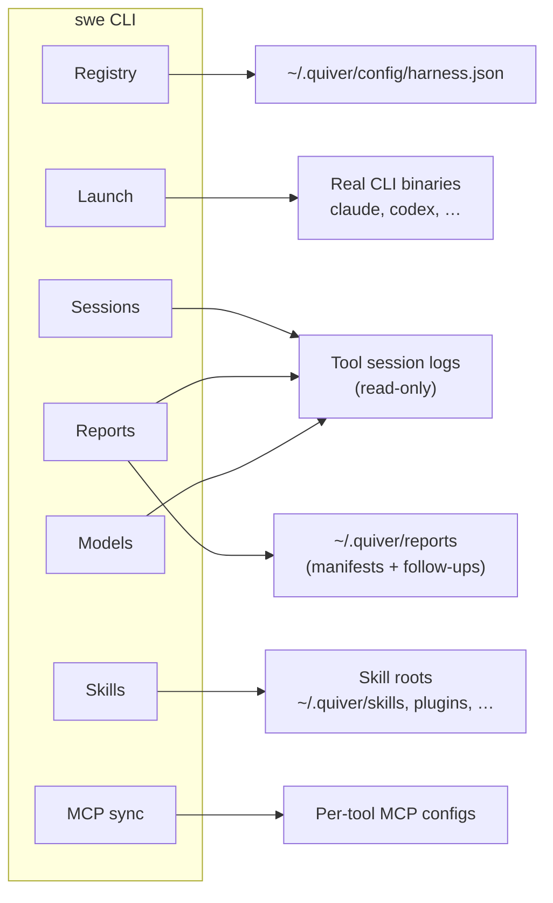

<p align="center">
  
</p>

<h1 align="center">
quiver
</h1>

<p align="center">
  <strong>One command to launch, resume, and analyze every AI coding CLI on your machine.</strong>
</p>

<p align="center">
  <a href="https://github.com/c-wenlong/quiver/actions/workflows/ci.yml"></a>
  <a href="https://app.codecov.io/gh/c-wenlong/quiver"></a>
  <a href="LICENSE"></a>
  <a href="https://www.python.org/downloads/"></a>
  
</p>

<p align="center">
  <a href="#install">Install</a> ·
  <a href="#quick-start">Quick start</a> ·
  <a href="#commands">Commands</a> ·
  <a href="#skills">Skills</a> ·
  <a href="#how-it-works">How it works</a> ·
  <a href="#contributing">Contributing</a>
</p>

---

**quiver** is a central manager for the growing zoo of AI coding command-line tools — Claude Code, Codex, Gemini CLI, Cursor CLI, opencode, Copilot, and many more.

It keeps a small registry of the harnesses you use, launches any of them (by name or short alias), lets you resume recent sessions across *any* agent, mines read-only usage analytics from each tool's own logs, discovers agent skills installed across your machine, and keeps MCP server configs in sync between tools.

The command you type is **`swe`** (short, fits in muscle memory). The project and Python package are named **quiver** — think of it as the quiver that holds all your arrows (see the mascot above).

```
$ swe list --usage

AI Coding Tools

   │ NAME     │ COMMAND  │ VERSION    │ ALIASES │ 100d │ REMAINING      │ INST │ DESCRIPTION
──────────────────────────────────────────────────────────────────────────────────────────────────────────────────────────────────────────
 ★ │ claude   │ claude   │ 2.1.126    │ cc      │  412 │ 68% 5h: 3h12m  │ ✓    │ Claude Code by Anthropic — agentic coding in the terminal
 ★ │ codex    │ codex    │ 0.133.0    │ cx      │  288 │ 42% 5d19h      │ ✓    │ OpenAI Codex CLI
   │ cursor   │ agent    │ 2026.06.24 │ cs      │    4 │ —              │ ✓    │ Cursor CLI — AI-powered editor agent
   │ droid    │ droid    │ 0.24.0     │ df      │   31 │ —              │ ✓    │ Factory Droid CLI
   │ gemini   │ gemini   │ 0.35.1     │ gg      │   12 │ —              │ ✓    │ Gemini CLI by Google
   │ opencode │ opencode │ 1.17.11    │ oc      │   96 │ —              │ ✓    │ opencode — open source terminal agent

  6/6 installed  ·  2 starred  ·  swe use <name>  │  swe hs star <name>  │  swe hs archive <name>  │  swe info <name>
  ★ = favourited (pinned top, neon border)
  tags:  agentic  coding  local
```

## Why quiver?

If you juggle more than one AI coding agent you end up with a mess:

- Different launch commands and resume flags for every tool
- Usage scattered across a dozen log formats
- MCP server definitions copy-pasted between configs
- Skills installed in five different directory trees

**quiver** puts a single, consistent front door on all of it — without wrapping or replacing the tools themselves. It reads their logs read-only and shells out to the real binaries.

## Features

| Area | What you get |
| --- | --- |
| **Registry** | List every AI coding CLI with tags, aliases, versions, and install status |
| **Launch** | Start any tool by name or alias; extra args pass straight through (`execvp`) |
| **Sessions** | Unified, time-sorted view of recent sessions across 21 agents + one-command resume |
| **Models** | Aggregate model usage parsed read-only from each tool's session logs |
| **Skills** | Discover, list, catalog, symlink, and move skills across harness roots |
| **MCP sync** | Inspect, compare, validate, and copy MCP servers between tools |
| **Rate limits** | Remaining quota + reset countdown for starred Codex, Copilot, Claude, Droid, Antigravity, Freebuff, Cursor, and Devin harnesses |
| **Favourites** | Pin harnesses to the top of `swe list` and opt them into usage polling |
| **Autocomplete** | Shell tab-completion for zsh, bash, and fish (tool names, aliases, tags, flags) |
| **Providers** | Manage API keys and metadata for 27 built-in LLM providers, plus your own |

## Install

**Requirements:** Python 3.11+, and nothing else. The core CLI has **no
third-party runtime dependencies** at all. The MCP history server is the only
extra that adds a real dependency, and you opt into it.

> **On Python 3.10?** `v0.2.9` is the last release that runs on it; the floor
> moved to 3.11 afterwards. Pin that tag:
>
> ```bash
> pipx install git+https://github.com/c-wenlong/quiver.git@v0.2.9
> ```
>
> Check with `python3 --version`. Ubuntu 22.04 LTS ships 3.10, so it needs the
> pin or a newer interpreter. Debian 12 (3.11), Ubuntu 24.04 (3.12) and current
> Fedora and Homebrew are all fine as they are.

### pipx (recommended)

```bash
pipx install git+https://github.com/c-wenlong/quiver.git
swe --help
```

### Nix

`nix run github:c-wenlong/quiver -- --help` works one-off. To install, add
the flake as an input and put the package on your list:

```nix
inputs.quiver = {
  url = "github:c-wenlong/quiver";
  inputs.nixpkgs.follows = "nixpkgs";
};
# then, in home.packages or environment.systemPackages:
inputs.quiver.packages.${system}.default
```

The build runs the test suite, so `nix build` is also the fastest full check
of a clone. `nix develop` opens a shell with `src/` on `PYTHONPATH`.

### From source

```bash
git clone https://github.com/c-wenlong/quiver.git
cd quiver
python3 -m venv .venv && source .venv/bin/activate   # Windows: .venv\Scripts\activate
pip install -e .
swe --help
```

### Optional: MCP history server

Exposes recent sessions as an MCP tool (requires the `server` extra):

```bash
pip install -e ".[server]"
python -m quiver.mcp_server
```

## Quick start

```bash
swe setup                    # six-stage interactive onboarding wizard
swe setup --quick            # only missing or actionable setup stages
swe setup report             # configure coding-session report models only
swe setup --apply            # apply safe defaults without prompting
swe harness discover         # scan PATH for unregistered AI CLIs
swe mcp discover             # find MCP servers not in ~/.quiver/mcp.json
swe init                     # create ~/.quiver and link every harness to it

swe list                     # all registered tools, starred first
swe list agentic             # filter by tag
swe list --usage             # add the 100d session count and remaining quota
swe list --links             # add AGENTS.MD and SKILLS link status instead
swe list -n                  # bypass caches and refresh starred harness usage
swe info claude              # command, version, path, tags, aliases
swe check                    # probe installed tools and refresh versions
swe doctor                   # diagnose Node/npm/PATH issues, plus registry drift
swe find                     # where shared assets live and what links to them
swe find skills --harness=all # include archived harnesses' rows too

swe use cc                   # launch Claude Code (alias for `claude`)
swe use codex --help         # extra args are passed straight through

swe harness star gemini      # pin a harness and enable its usage polling (toggle)
swe harness archive aider "not a fit" # shelve a harness you ruled out
swe edit claude --description "..." # edit registry fields (or interactive mode)

swe session                  # last 10 sessions across ALL agents
swe session use 3            # cd into session #3 and resume it
swe session --agent claude   # filter by agent
swe session --here           # only sessions in the current directory
swe session -d 5             # sessions active during the latest 5 calendar dates
swe session -w 3             # sessions active during the latest 3 times 7 dates
swe session -s 2026-07-01 -e 2026-07-30 # inclusive explicit date range
swe session --search refactor # filter by title/path/agent text
swe session -i               # arrow-key picker; space previews, Enter resumes

swe config setup report      # choose cheap summary and strong report models
swe report daily             # preview cost, confirm, then generate a report
swe report weekly --here     # weekly report for the current repository
swe report followups         # list user-owned follow-up work
swe report warnings <manifest.json> # warnings recorded for one report

swe models                   # model usage across all tools
swe models -t -p             # grouped by tool, with provider prefix

swe autocomplete zsh         # generate + inject shell tab-completion

swe skills list              # every SKILL.md across all skill roots
swe skills refactor          # filter skills by name or scope
swe skills discover          # find skill catalogs on Desktop/Documents
swe skills discover --apply  # register discovered catalogs
swe skills catalog add ~/path/to/skills [label]
swe find skills -r           # every skill root, and what it links to
swe skills help catalog      # detailed help for catalog subcommands

swe mcp list                 # matrix of MCP servers across tools
swe mcp sync opencode cursor # copy MCP servers between tools
```

## Commands

| Command | Aliases | Description |
| --- | --- | --- |
| `swe init [--check\|--force\|--full\|--migrate]` | | Create `~/.quiver` and symlink every harness to it |
| `swe setup [section] [--quick]` | | Sectioned wizard for harnesses, providers, MCP, skills, reports, and verification |
| `swe list [tag] [--usage\|--links] [--scope=…] [-r\|-n]` | `ls` | List tools; `--usage` is the only part that touches the network |
| `swe list edit [--reset]` / `swe list legend` | | Choose which columns show; explain the link glyphs |
| `swe info <name\|alias>` | | Show command, version, path, tags, aliases |
| `swe add <name> <cmd> …` | | Register or update a tool |
| `swe edit <name> [--field val …]` | | Edit registry fields (flags or interactive) |
| `swe remove <name\|alias>` | `rm` | Remove from registry (does not uninstall) |
| `swe harness <subcommand> …` | `hs` | Every harness verb: `list`, `edit`, `star`, `archive`, `discover` |
| `swe harness star <name\|alias>` | `hs star` | Toggle a harness favourite (pins it to top of `swe list`) |
| `swe harness archive <name\|alias> [why]` | `hs archive` | Shelve a harness you've ruled out |
| `swe check` | | Probe live versions and refresh registry |
| `swe doctor` | | Diagnose Node/npm/PATH issues hiding global installs, plus registry/help drift |
| `swe install <name>` | | Install a harness via npm and register it |
| `swe harness discover [--apply\|--apply-all] [--json] [--all]` | | Scan PATH and home dirs for unregistered AI coding CLIs |
| `swe discover [--apply]` | | Alias for `swe harness discover` |
| `swe find [amd\|skills\|plugins\|mcps] [--scope=global\|local\|all] [--harness=active\|all]` | | Read-only view of shared assets and what links to them |
| `swe autocomplete [zsh\|bash\|fish]` | | Generate + inject shell tab-completion |
| `swe use <name\|alias> [args…]` | `run` | Launch a tool (replaces current process) |
| `swe session [N] [use N] [-i] [--agent X] [--here] [--search T] [date flags]` | | List, browse, or resume recent sessions |
| `swe report daily\|weekly [date flags]` | | Preview and summarize coding sessions |
| `swe report followups\|followup …` | | Manage and launch work from persistent follow-ups |
| `swe report warnings <manifest.json>` | | Print the warnings recorded for one report |
| `swe config [get\|set\|unset\|edit\|check\|setup]` | | Manage credential-free Quiver configuration |
| `swe models [-t] [-p]` | | Model usage analytics |
| `swe skills list` / `swe skills <filter> [-d]` | `sk` | List agent skills and paths (bare `swe skills` prints the overview) |
| `swe skills tree` / `swe skills scope list` | | Kept for muscle memory; both forward to `swe find skills` |
| `swe skills link <harness> [target]` | | Symlink harness skills root to shared/other |
| `swe skills unlink <harness> [--mkdir]` | | Break harness symlink (optional empty dir) |
| `swe skills move <name> --from A --to B` | | Move skill folder between roots |
| `swe skills discover [--apply]` | | Scan Desktop/Documents for skill catalogs |
| `swe skills catalog add [path] [label]` | | Register a skills directory (default: `.`) |
| `swe skills catalog .` | | Add the current directory as a catalog |
| `swe skills catalog list` | | List configured skill catalogs |
| `swe skills help [topic]` | | Per-topic help (catalog, discover, tree, link, …) |
| `swe tags` | | List tags and associated tools |
| `swe aliases` | | List alias → tool mappings |
| `swe mcp <subcommand> …` | | MCP server management (see below) |
| `swe providers [<subcommand>] …` | `pv` | Provider API key + metadata management |
| `swe help [command]` | `-h` | Full or per-command help |

Run `swe <command> --help` for detailed help on any command.

### Coding-session reports

`swe report daily` and `swe report weekly` read the same local histories shown
by `swe session`. Before calling a model, Quiver removes startup-only sessions,
reuses digest-cached summaries, groups short meaningful sessions by Git
repository, and displays the planned model-call count and estimated input
tokens. Nothing runs until you confirm. Plans above the configured call or
token limits require typing the exact phrase `process all`.

The first run opens `swe config setup report`. Configure an inexpensive Claude
or Codex model for project/session summaries and a stronger model for the final
report. Credentials remain in the harness's existing login or environment.

Reports omit empty sections and persist under `~/.quiver/reports/` with
their manifests, session-summary cache, exclusions, cadence cursors, and
follow-up ledger. Follow-up status is always manual:

```bash
swe report followup done fu_1234
swe report followup work fu_1234 --resume
swe report followup work fu_1234 --new --harness codex
```

Date flags use local calendar boundaries: `-d N` means the latest N dates,
`-w N` means N times seven dates, and `-s YYYY-MM-DD -e YYYY-MM-DD` supplies an
inclusive custom range. Custom ranges create reusable summaries without moving
the normal daily or weekly cursor.

### Shell autocomplete

```bash
swe autocomplete zsh    # or bash, fish
```

Generates a completion script and injects it into your shell profile. After running, restart your terminal or `source ~/.zshrc` (or equivalent). The completion provides:

- Subcommand names with descriptions (`swe <TAB>`)
- Tool names and aliases from your registry (`swe use <TAB>`)
- Tags for filtering (`swe list <TAB>`)
- Flags (`swe list --<TAB>`, `swe session --<TAB>`)

Idempotent — safe to re-run. Uses a hidden `swe __complete` command for dynamic completions.

### `swe providers` subcommands

| Subcommand | Description |
| --- | --- |
| `swe providers list [-d] [--api-keys-dir=DIR] [<filter>]` | Show every provider with its masked key (``-`` if no key) |
| `swe providers info <name\|alias>` | Full details for one provider + key file path |
| `swe providers add <name> [desc] [--url URL] [--env ENV, …] [--file NAME]` | Register a provider in `~/.quiver/config/providers.json` |
| `swe providers remove <name>` | Unregister a provider (does **not** delete your key file) |

Keys live as plain-text files in `~/.api_keys/` (one per provider, filename = canonical slug). quiver stores **metadata only** — never the key string itself. Mask format: `first8 + *** + last4 + (len=N)`; short keys fall back to `first3 + *** + (len=N)`; missing keys render as `-`. Override the keys dir per-invocation with `--api-keys-dir=DIR`.

Built-in providers (27): `openai`, `anthropic`, `gemini`, `deepseek`, `zai`, `minimax`, `kimi`, `qwen`, `mimo`, `xai`, `stepfun`, `groq`, `upstage`, `cerebras`, `mistral`, `routing_run`, `opencode_zen`, `openrouter`, `together_ai`, `fireworks_ai`, `vercel_gateway`, `nebius`, `featherless`, `cohere`, `perplexity`, `github`, `huggingface`. Add your own with `swe providers add`.

### `swe mcp` subcommands

| Subcommand | Description |
| --- | --- |
| `swe mcp discover [--apply]` | Find MCP servers across tool configs |
| `swe mcp list [tool]` | Matrix view of MCP servers across tools |
| `swe mcp status [tool]` | List with health checks |
| `swe mcp sync <source> <target…>` | Copy servers between tools (format conversion) |
| `swe mcp diff <t1> <t2>` | Compare two tools' MCP configs |
| `swe mcp edit <tool> <name>` | Edit one server in `$EDITOR` |
| `swe mcp validate [tool…]` | Validate MCP config shape |
| `swe mcp doctor [--strict]` | Deep diagnostics |

Flags for `sync`: `--only=a,b`, `--all`, `--force`, `--skip-conflicts`, `--dry-run`,
`--prune`, `--strict`. Every subcommand has its own `swe mcp <name> help`.

## Skills

Agent skills are folders containing a `SKILL.md` file. quiver scans built-in harness roots (shared, Cursor, Claude, Codex, plugins) plus any catalogs you register.

### Typical layout

Most setups symlink every harness to one shared tree:

```
~/.quiver/skills          ← canonical shared skills
~/.codex/skills    → shared
~/.claude/skills   → shared
~/.cursor/skills   → shared
```

Run `swe find skills -r` to inspect this layout — it walks the filesystem, so it
sees roots a fixed candidate list would miss. `swe skills tree` and
`swe skills scope list` forward to the same view. `swe skills link` and
`swe skills unlink` record what they did in `~/.quiver/config/skill_links.json`.

### Discover and register catalogs

Project skill folders outside the default roots can be registered manually or discovered automatically:

```bash
swe skills discover              # scan ~/Desktop and ~/Documents for */skills/
swe skills discover --apply      # register new catalogs
cd ~/Projects/my-app/skills && swe skills catalog .
swe skills catalog list
```

Catalogs live in `~/.quiver/config/skill_catalogs.json`. Nested catalogs (e.g. `gbrain/skills` inside `ai-engineering/skills`) are collapsed to the outermost match.

### Symlinks and moving skills

Link all harnesses to shared (what `swe setup` step 4 does):

```bash
swe skills link codex
swe skills link claude shared
```

Give one harness its own private skills tree:

```bash
swe skills unlink codex --mkdir
swe skills move my-skill --from shared --to codex
```

Run `swe skills help link`, `swe skills help move`, etc. for detailed usage.

### Listing skills

```bash
swe skills list                  # every skill: NAME, SCOPE, PATH
swe skills <filter>              # filter by name, scope, or harness
swe skills <filter> -d           # include descriptions
swe find skills -r               # every root with symlink kind + counts
```

## How it works


```mermaid
flowchart LR
  subgraph swe["swe CLI"]
    R[Registry]
    L[Launch]
    S[Sessions]
    RP[Reports]
    M[Models]
    K[Skills]
    P[MCP sync]
  end

  R --> TJ["~/.quiver/config/harness.json"]
  S --> Logs["Tool session logs\n(read-only)"]
  RP --> Logs
  RP --> Reports["~/.quiver/reports\n(manifests + follow-ups)"]
  M --> Logs
  K --> Roots["Skill roots\n~/.quiver/skills, plugins, …"]
  P --> MCP["Per-tool MCP configs"]
  L --> Bin["Real CLI binaries\nclaude, codex, …"]
```

- **Registry** — your tool list lives in `~/.quiver/config/harness.json`. It starts empty: `swe discover` matches what is actually on your PATH against a built-in recognition table, and only what it finds gets registered, so the file describes this machine rather than a wish list. Every entry carries its own `state` (`active`, `starred`, or `archived`) instead of splitting favourites and shelved tools into separate files. Edited by `swe add` / `remove` / `check` / `swe harness star` / `swe harness archive`. Not shipped with the package (see `examples/tools.example.json`).
- **Launching** — `swe use` resolves a name or alias and replaces the current process via `os.execvp`, so the tool behaves exactly as if you'd typed it directly.
- **Analytics** — `swe session` and `swe models` parse each tool's on-disk logs (e.g. `~/.claude/projects`, `~/.codex/sessions`, `~/.local/share/opencode/opencode.db`). quiver **never writes** to those files.
- **Reports** — normalizes those logs into semantic messages, filters startup noise, batches useful sessions by project, and invokes configured Claude/Codex models only after a local cost preview is approved.
- **Skills** — walks known skill roots under `$HOME` (and `./.cursor/skills`), de-duplicates symlinked paths, reads each `SKILL.md` front matter. Catalogs from `skill_catalogs.json` extend the scan; `swe skills link` / `unlink` / `move` manage harness symlinks without touching skill content.
- **MCP sync** — reads each tool's native MCP config, normalizes to a canonical shape, re-emits in the target format. Nothing is written unless you run a real (non-`--dry-run`) `sync` or `edit`.
- **Rate limits** — `swe list` shows the percentage of quota remaining and fetches usage data only for starred harnesses that expose a rate limit API; Freebuff instead shows remaining/total referral-unlocked GLM 5.2 sessions. Starring is the explicit opt-in for provider traffic. Unstarred harnesses still show registry details and local 100-day session counts without running usage scripts. Codex, Copilot, Claude, Droid, Freebuff, Cursor, and Devin use their authenticated provider endpoints; Cursor shows the more exhausted of its included Auto-mode and named-model (API) usage for the current billing cycle. Antigravity is read through the running app or CLI's loopback-only quota RPC, so quiver never reads its Google OAuth credential directly; the last successful value remains available from the outage cache when Antigravity is closed. Results are cached in `rate_limits_cache.json` (5-minute TTL); `swe list --refresh`, `swe list -r`, and `swe list -n` bypass the fresh cache for starred harnesses only. The architecture is pluggable — additional fetchers can be registered in `harness/rate_limits.py`. On macOS python.org builds that lack CA certificates, remote fetchers retry with the operating system's own CA bundle (or `certifi` if installed), still fully verified; with no bundle at all they send nothing and print how to fix it.

## Configuration

Everything quiver persists lives under one root, `~/.quiver/`. It is split by
lifecycle so the directory can be a git repo: `config/` and the shared
`AGENTS.md` / `skills/` are worth versioning, `cache/` and `backups/` are not
(a generated `.gitignore` covers them).

The root sits in `$HOME` rather than `$HOME/.config` deliberately. Quiver
manages coding harnesses, and most harness config directories are `$HOME/.<tool>`.

| Path | Purpose | Shipped? |
| --- | --- | --- |
| `AGENTS.md` | Shared instructions, symlinked into each harness under its own filename | No — created by `swe init` |
| `skills/` | Shared skill tree, symlinked in as every harness's `skills/` | No — created by `swe init` |
| `.linkignore` | Paths `swe init` leaves alone, one gitignore-style pattern per line | No — seeded by `swe init` |
| `config/harness.json` | Your tool registry (versions, aliases, and per-harness state for this machine) | No — auto-created |
| `mcp.json` | MCP source of truth | No — created by `swe mcp discover --apply` |
| `config/providers.json` | Provider metadata and key locations | No — auto-created |
| `config/config.json` | Credential-free Quiver and report runner settings | No — created by `swe config` |
| `config/skill_catalogs.json` | Extra skill catalog directories | No — auto-created by discover/add |
| `config/skill_links.json` | Recorded harness skill-root symlinks | No — written by `swe skills link` / `unlink` |
| `cache/session_cache.json` | Cached session parse results (60s TTL) | No — auto-created |
| `cache/rate_limits_cache.json` | Cached rate limit fetches (5-minute TTL) | No — auto-created |
| `completions/` | Shell completion scripts (zsh/bash/fish) | No — created by `swe autocomplete` |
| `reports/` | Reports, manifests, summary cache, cursors, exclusions, and follow-ups | No — created by `swe report` |
| `backups/` | Anything `swe init` replaced, timestamped | No — auto-created |

Upgrading from a pre-0.2.7 install: `swe init --migrate` moves `~/.config/swe`
into this layout and removes the old root.

The MCP subsystem also reads/writes each tool's native config (e.g. `~/.claude.json`, `~/.cursor/mcp.json`, `~/.config/opencode/opencode.json`).

## Supported tools

`swe discover` recognises **24 AI coding CLIs** on sight: Claude Code, Codex, Gemini
CLI, GitHub Copilot CLI, Cursor CLI, opencode, Amp, Kimi, Qwen Code, Mistral Vibe,
Mimo, Crush, Cline, Goose, Aider, Continue, pi, Forge, Factory Droid, Augment, Kiro,
Blackbox, Freebuff, and Ollama. That is a recognition table, not a seed — nothing is
written to your registry until discovery finds the binary on PATH. Register anything
else by hand with `swe add`.

Session parsers currently cover **21 tools**: opencode, Claude Code, Gemini/Antigravity, Codex, Cursor, pi, Freebuff, Droid, Copilot, Continue, Crush, Amp, Kimi, Hermes, Grok, Cline, Forge, Mimo, Tau, and Devin. Parsers are built on three reusable family engines (SQLite, JSONL, JSON) with declarative per-tool configs. Model analytics cover opencode, Claude Code, Codex, and Freebuff.

## Development

```bash
python3 -m venv .venv && source .venv/bin/activate
pip install -e ".[test]"
python -m unittest discover -s tests -p 'test_*.py'
test_home="$(mktemp -d)"
HOME="$test_home" python -m coverage run -m unittest discover -s tests -p 'test_*.py'
python -m coverage combine
python -m coverage report
```

CI runs the suite against a throwaway `$HOME`, so it never touches real config or
counts machine-local coding sessions as test coverage. Coverage includes child
processes, tracks branches, and must remain above the configured regression
floor. See the dated [coverage audit](docs/COVERAGE.md) for current risk areas;
the badge at the top of this README follows `main` live.

### Reinstalling after changes

The `swe` command is a pip-installed console entry point (`[project.scripts]` in `pyproject.toml`). With an **editable** install (`pip install -e .`), new Python files are picked up automatically. But if you ever installed with a plain `pip install .` (non-editable), files are copied to site-packages and new modules won't appear until you reinstall:

```bash
pip install -e .          # switch to editable, or sync site-packages
swe list                  # verify the feature works end-to-end
```

> **Common pitfall:** unit tests run with `PYTHONPATH=src`, so they can pass while the installed `swe` command silently fails because it's reading from a stale non-editable site-packages copy. Always verify with the real `swe` command after adding files — if the feature doesn't show up, reinstall.

For **pipx** installs (always non-editable):

```bash
pipx install --force git+https://github.com/c-wenlong/quiver.git
```

### E2e verification checklist

Every feature that adds files or modifies `cmd_*` handlers must pass this checklist before opening a PR:

1. ✅ Unit tests pass: `python -m unittest discover -s tests -p 'test_*.py'`
2. ✅ Package reinstalled: `pip install -e .`
3. ✅ Verified with real `swe` command (not just `PYTHONPATH=src python -m quiver.cli`)
4. ✅ PR opened with clear description

## Renaming

quiver centralizes naming so you can change it:

1. **CLI command** — `CLI_NAME` in `src/quiver/__init__.py` and `[project.scripts]` in `pyproject.toml`, then reinstall
2. **Data dir** — `DATA_DIR_NAME` in `src/quiver/__init__.py`; the root becomes `~/.<name>`
3. **Package name** — rename `src/quiver/`, update imports and `pyproject.toml`

## Contributing

Issues and pull requests are welcome. [CONTRIBUTING.md](CONTRIBUTING.md) covers the
PR process, one concern per PR, and what CI will check. By taking part you agree to the
[Code of Conduct](CODE_OF_CONDUCT.md). Need help? See [SUPPORT.md](SUPPORT.md).

| Document | What it covers |
| --- | --- |
| [AGENTS.md](AGENTS.md) | The brief for coding agents: commands, throwaway-`$HOME` rule, gotchas log |
| [ARCHITECTURE.md](ARCHITECTURE.md) | Layering rules, `~/.quiver` layout, registry and link states, session engines |
| [CONTRIBUTING.md](CONTRIBUTING.md) | How to propose and land a change |
| [SECURITY.md](SECURITY.md) | Supported versions and how to report a vulnerability |
| [SUPPORT.md](SUPPORT.md) | Where to get help, in order: docs, `swe doctor`, issues |
| [CODE_OF_CONDUCT.md](CODE_OF_CONDUCT.md) | Contributor Covenant 2.1 |
| [CHANGELOG.md](CHANGELOG.md) | Release history |
| [docs/COVERAGE.md](docs/COVERAGE.md) | Dated coverage audit and current risk areas |

## License

MIT — see [LICENSE](LICENSE).
